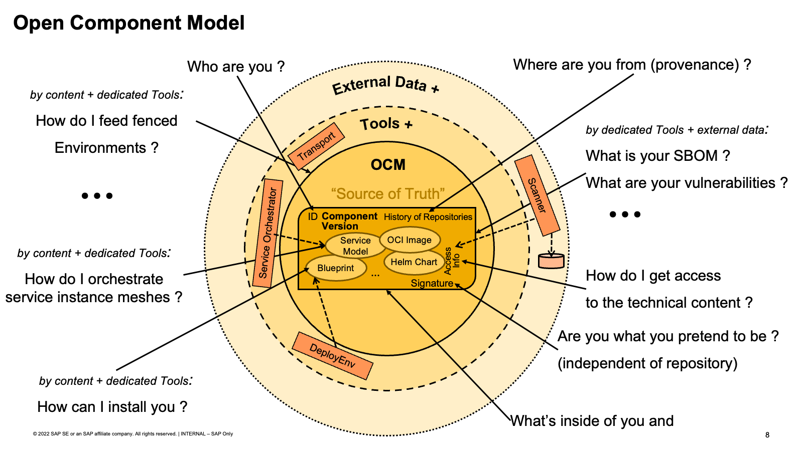

# Open Component Model (OCM)

The _Open Component Model (OCM)_ is an open standard to describe software-bill-of-deliveries (SBOD). OCM is a technology-agnostic and machine-readable format focused on the software artifacts that must be delivered for software products. OCM provides a globally unique identity scheme throughout the entire software lifecycle management process, from build to compliance, to deployment. OCM makes software artifacts queriable: what is inside, where is it from, is it authentic etc.

The following chapters provide a formal description of the format to describe software artifacts and a storage layer to persist those and make them available from remote.

## Specification
* 1.[Model](docs/01-model/README.md)
  * 1.1.[OCM Model](doc/01-model/01-model.md#ocm-model)
    * 1.1.1.[Components and Component Versions](doc/01-model/01-model.md#components-and-component-versions)
    * 1.1.2.[Component Repositories](doc/01-model/01-model.md#component-repositories)
    * 1.1.3.[Summary](doc/01-model/01-model.md#summary)
  * 1.2.[Model Elements](doc/01-model/02-elements.md#model-elements)
    * 1.2.1.[Components and Component Versions](doc/01-model/02-elements.md#components-and-component-versions)
    * 1.2.2.[Artifacts (Resources and Sources)](doc/01-model/02-elements.md#artifacts-resources-and-sources)
    * 1.2.3.[Sources](doc/01-model/02-elements.md#sources)
    * 1.2.4.[Resources](doc/01-model/02-elements.md#resources)
    * 1.2.5.[References](doc/01-model/02-elements.md#references)
    * 1.2.6.[Identifiers](doc/01-model/02-elements.md#identifiers)
    * 1.2.7.[Access Specification](doc/01-model/02-elements.md#access-specification)
    * 1.2.8.[Labels](doc/01-model/02-elements.md#labels)
    * 1.2.9.[Repository Contexts](doc/01-model/02-elements.md#repository-contexts)
    * 1.2.10.[Signatures](doc/01-model/02-elements.md#signatures)
    * 1.2.11.[Digest Info](doc/01-model/02-elements.md#digest-info)
    * 1.2.12.[Signature Info](doc/01-model/02-elements.md#signature-info)
  * 1.3.[Example of a complete Component Version](doc/01-model/03-example.md#example-of-a-complete-component-version)
  * 1.4.[Extending the Open Component Model](doc/01-model/04-extensions.md#extending-the-open-component-model)
    * 1.4.1.[Functional extensions](doc/01-model/04-extensions.md#functional-extensions)
    * 1.4.2.[Semantic extensions](doc/01-model/04-extensions.md#semantic-extensions)
  * 1.5.[Model Contract](doc/01-model/05-contract.md#model-contract)
    * 1.5.1.[Example: Helm deployment](doc/01-model/05-contract.md#example-helm-deployment)
  * 1.6.[Conventions](doc/01-model/06-conventions.md#conventions)
    * 1.6.1.[Intended Environments](doc/01-model/06-conventions.md#intended-environments)
    * 1.6.2.[Selection of Usage Scenarios](doc/01-model/06-conventions.md#selection-of-usage-scenarios)
* 2.[Processing](docs/02-processing/README.md)
  * 2.1.[Referencing](doc/02-processing/01-references.md#referencing)
    * 2.1.1.[Example](doc/02-processing/01-references.md#example)
    * 2.1.2.[Relative Artifact References](doc/02-processing/01-references.md#relative-artifact-references)
    * 2.1.3.[Absolute Artifact References](doc/02-processing/01-references.md#absolute-artifact-references)
  * 2.2.[Transport](doc/02-processing/02-transport.md#transport)
    * 2.2.1.[Kinds of Transports](doc/02-processing/02-transport.md#kinds-of-transports)
  * 2.3.[Signing](doc/02-processing/03-signing.md#signing)
    * 2.3.1.[Signing Algorithms](doc/02-processing/03-signing.md#signing-algorithms)
    * 2.3.2.[Verification Procedure](doc/02-processing/03-signing.md#verification-procedure)
  * 2.4.[Normalization](doc/02-processing/04-digest.md#normalization)
    * 2.4.1.[Artifact Digest](doc/02-processing/04-digest.md#artifact-digest)
    * 2.4.2.[Normalization Types](doc/02-processing/04-digest.md#normalization-types)
    * 2.4.3.[Serialization Format](doc/02-processing/04-digest.md#serialization-format)
    * 2.4.4.[Recursive Digest Calculation](doc/02-processing/04-digest.md#recursive-digest-calculation)
  * 2.5.[Example](doc/02-processing/04-digest.md#example)
    * 2.5.1.[Simple Component-Version](doc/02-processing/04-digest.md#simple-component-version)
    * 2.5.2.[Component-Version With Reference](doc/02-processing/04-digest.md#component-version-with-reference)
  * 2.6.[Component Descriptor Normalization](doc/02-processing/04-digest.md#component-descriptor-normalization)
    * 2.6.1.[jsonNormalisationV1](doc/02-processing/04-digest.md#jsonnormalisationv1)
    * 2.6.2.[Relevant information in Component Descriptors](doc/02-processing/04-digest.md#relevant-information-in-component-descriptors)
    * 2.6.3.[Labels](doc/02-processing/04-digest.md#labels)
    * 2.6.4.[Exclude Resources from Normalization/Signing](doc/02-processing/04-digest.md#exclude-resources-from-normalizationsigning)
    * 2.6.5.[Generic Normalization Format](doc/02-processing/04-digest.md#generic-normalization-format)
  * 2.7.[Artifact Normalization](doc/02-processing/04-digest.md#artifact-normalization)
    * 2.7.1.[Blob Representation Format for Resource Types](doc/02-processing/04-digest.md#blob-representation-format-for-resource-types)
    * 2.7.2.[Interaction of Local Blobs, Access Methods, Uploaders and Media Types](doc/02-processing/04-digest.md#interaction-of-local-blobs-access-methods-uploaders-and-media-types)
* 3.[Persistence](docs/03-persistence/README.md)
  * 3.1.[Model Operations](doc/03-persistence/01-operations.md#model-operations)
  * 3.2.[Abstract Operations defined by the Open Component Model](doc/03-persistence/01-operations.md#abstract-operations-defined-by-the-open-component-model)
    * 3.2.1.[Repository Operations](doc/03-persistence/01-operations.md#repository-operations)
    * 3.2.2.[Access Method Operations](doc/03-persistence/01-operations.md#access-method-operations)
  * 3.3.[Mappings for OCM Persistence](doc/03-persistence/02-mappings.md#mappings-for-ocm-persistence)
    * 3.3.1.[Storage Backend Mappings for the Open Component Model](doc/03-persistence/02-mappings.md#storage-backend-mappings-for-the-open-component-model)
  * 3.4.[OCI Registries](doc/03-persistence/03-oci.md#oci-registries)
    * 3.4.1.[Specification Format](doc/03-persistence/03-oci.md#specification-format)
    * 3.4.2.[Element Mapping](doc/03-persistence/03-oci.md#element-mapping)
    * 3.4.3.[Version Mapping](doc/03-persistence/03-oci.md#version-mapping)
    * 3.4.4.[Blob Mappings](doc/03-persistence/03-oci.md#blob-mappings)
    * 3.4.5.[Example](doc/03-persistence/03-oci.md#example)
  * 3.5.[Common Transport Format (CTF)](doc/03-persistence/04-files.md#common-transport-format-ctf)
    * 3.5.1.[Specification Format](doc/03-persistence/04-files.md#specification-format)
    * 3.5.2.[Element Mapping](doc/03-persistence/04-files.md#element-mapping)
    * 3.5.3.[Blob Mappings](doc/03-persistence/04-files.md#blob-mappings)
    * 3.5.4.[Examples](doc/03-persistence/04-files.md#examples)
  * 3.6.[Component Archive Format](doc/03-persistence/04-files.md#component-archive-format)
    * 3.6.1.[Specification Format](doc/03-persistence/04-files.md#specification-format)
    * 3.6.2.[Element Mapping](doc/03-persistence/04-files.md#element-mapping)
    * 3.6.3.[Blob Mappings](doc/03-persistence/04-files.md#blob-mappings)
    * 3.6.4.[Examples](doc/03-persistence/04-files.md#examples)
  * 3.7.[AWS S3](doc/03-persistence/05-s3.md#aws-s3)
    * 3.7.1.[Specification Format](doc/03-persistence/05-s3.md#specification-format)
    * 3.7.2.[Element Mapping](doc/03-persistence/05-s3.md#element-mapping)
    * 3.7.3.[Blob Mapping](doc/03-persistence/05-s3.md#blob-mapping)
4.  [Glossary](doc/glossary.md)

## Central OCM project web page

Check out the main project [web page](https://ocm.software) to find out more about OCM. It is your central entry point to all kind of ocm related [docs and guides](https://ocm.software/docs/overview/context), this [spec](https://ocm.software/spec/) and all project related [github repositories](https://github.com/open-component-model). It also offers a [Getting Started](https://ocm.software/docs/guides/getting-started-with-ocm) to quickly make your hands dirty with ocm, its toolset and concepts :-)

## Contributing

Code contributions, feature requests, bug reports, and help requests are very welcome. Please refer to the [Contributing Guide in the Community repository](https://github.com/open-component-model/community/blob/main/CONTRIBUTING.md) for more information on how to contribute to OCM.

OCM follows the [CNCF Code of Conduct](https://github.com/cncf/foundation/blob/main/code-of-conduct.md).

## Licensing

Copyright 2022 SAP SE or an SAP affiliate company and Open Component Model contributors.
Please see our [LICENSE](LICENSE) for copyright and license information.
Detailed information including third-party components and their licensing/copyright information is available [via the REUSE tool](https://api.reuse.software/info/github.com/open-component-model/ocm-spec).
